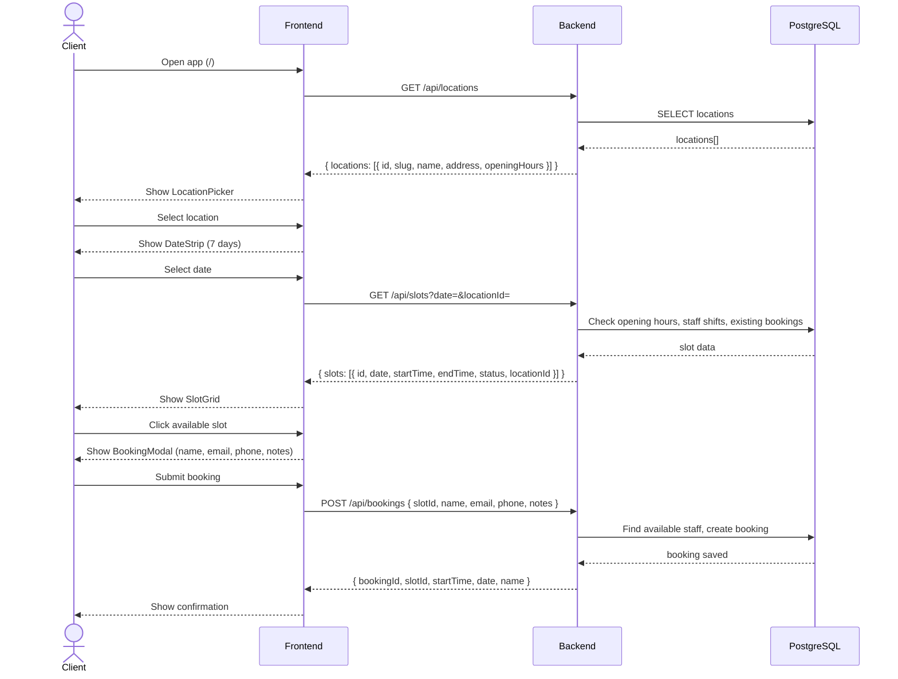
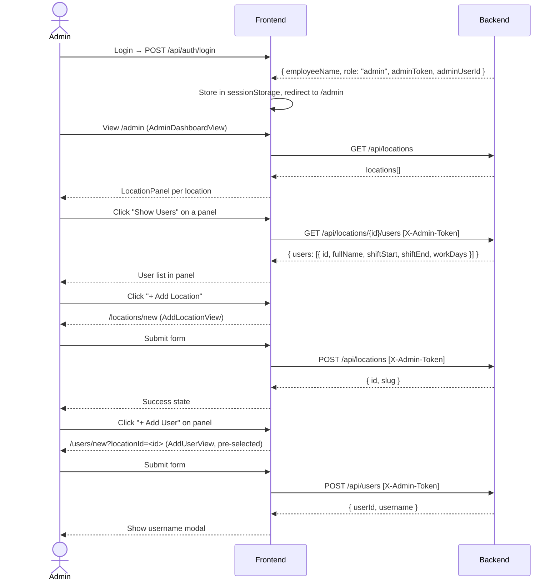
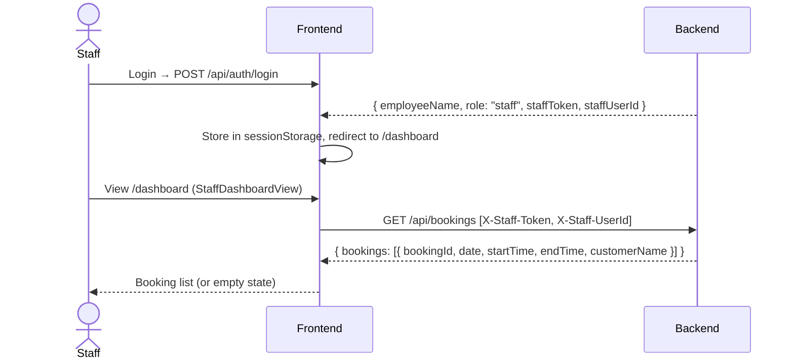

# TimeIsOnMySide — Architecture

## System Overview

A time-slot booking platform with three user roles:
- **Admin** — manages locations and staff
- **Staff** — views bookings assigned to them
- **Client** (anonymous) — browses locations, picks a date, books a slot

---

## Tech Stack

| Layer | Technology |
|-------|-----------|
| Frontend | Vue 3 + Vite + Pinia + Vue Router + Zod |
| Backend | ASP.NET Core 8 + EF Core 8 + PostgreSQL |
| Auth | Stateless HMAC daily token (X-Admin-Token / X-Staff-Token) |
| Validation | FluentValidation (backend) + Zod (frontend) |

---

## Component Architecture (Frontend)

```
src/
  views/
    BookingView.vue          — client home: location → date → slots → booking
    LoginView.vue            — login form (redirects by role)
    AdminDashboardView.vue   — admin home: location panels
    AddLocationView.vue      — admin: create location with opening hours
    AddUserView.vue          — admin: create staff user (pre-select via ?locationId)
    StaffDashboardView.vue   — staff: view assigned bookings
  components/
    AppHeader.vue            — sticky header, user menu, admin actions
    LocationPanel.vue        — location card with Show Users toggle + Add User
    LocationPicker.vue       — horizontal location selector
    DateStrip.vue            — 7-day date selector strip
    SlotGrid.vue             — slot grid (loading / empty / cards)
    SlotCard.vue             — individual slot button (available / unavailable)
    BookingModal.vue         — booking form modal
  stores/
    authStore.ts             — session-persisted auth (role, tokens, userId)
    bookingStore.ts          — locations, slots, booking state
  api/
    auth.ts                  — POST /api/auth/login
    booking.ts               — GET /api/locations, GET /api/slots, POST /api/bookings
    bookings.ts              — GET /api/bookings (staff)
    locations.ts             — POST /api/locations, GET /api/locations/{id}/users
    users.ts                 — POST /api/users
    schemas.ts               — Zod schemas for all shapes
  composables/
    useSlots.ts              — date strip state + slot filtering
    useBookingForm.ts        — booking form state
```

---

## Sequence Diagrams

### 1. Client Booking Flow



---

### 2. Admin Flow — Create Location & Staff



---

### 3. Staff Flow — View Bookings



---

## Backend API Reference

| Method | Route | Auth | Description |
|--------|-------|------|-------------|
| POST | /api/auth/login | — | Login, returns role-based token |
| POST | /api/auth/logout | — | Logout (stateless, clears client) |
| GET | /api/locations | — | List all locations |
| POST | /api/locations | Admin | Create location |
| GET | /api/locations/{id}/users | Admin | List staff for a location |
| POST | /api/users | Admin | Create staff user |
| GET | /api/slots?date&locationId | — | Get slots for a date+location |
| POST | /api/bookings | Rate-limited | Create booking (allocates staff) |
| GET | /api/bookings | Staff | Get bookings for logged-in staff |

---

## Slot Availability Rules

A slot is **available** when:
1. The location has opening hours configured for that day of week
2. The slot time falls within location opening hours
3. At least one staff member works at that location on that day
4. At least one staff member's shift covers that slot time
5. Not all covering staff members are already booked for that slot

A slot is **unavailable** when:
- All available staff are already booked for that slot
- No staff work that day/shift
- Location is closed that day

Slots are generated as 30-minute increments from 09:00–17:00 (filtered to opening hours and staff shifts).

---

## Auth Model

```
Login response:
  Admin → adminToken (HMAC) + adminUserId
  Staff → staffToken (HMAC) + staffUserId

Token format: HMAC-SHA256(date:userId, secret)
  - Rotates daily (date is part of the message)
  - Validated server-side with CryptographicOperations.FixedTimeEquals

Headers:
  Admin endpoints: X-Admin-Token + X-Admin-UserId
  Staff endpoints: X-Staff-Token + X-Staff-UserId
```

---

## Data Model

```
LocationEntity
  id (Guid PK)
  slug (unique, auto-generated from name)
  name
  address?
  openingHours (JSON: { monday: { openTime, closeTime } | null, ... })
  createdAt

UserEntity
  id (Guid PK)
  username (unique, auto-generated: firstname + 4-digit suffix)
  passwordHash
  role ("admin" | "staff")
  fullName, firstName, lastName
  locationId (FK → LocationEntity, nullable)
  shiftStart, shiftEnd (TimeOnly)
  workDays (JSON array of day names)
  createdAt

BookingEntity
  id (Guid PK)
  bookingRef (unique, "bk-" + 8 random alphanumeric)
  staffId (FK → UserEntity)
  slotDate (DateOnly)
  startTime, endTime (TimeOnly)
  customerName, customerEmail, customerPhone
  notes?
  createdAt
  UNIQUE INDEX: (staffId, slotDate, startTime) — prevents double-booking
```
