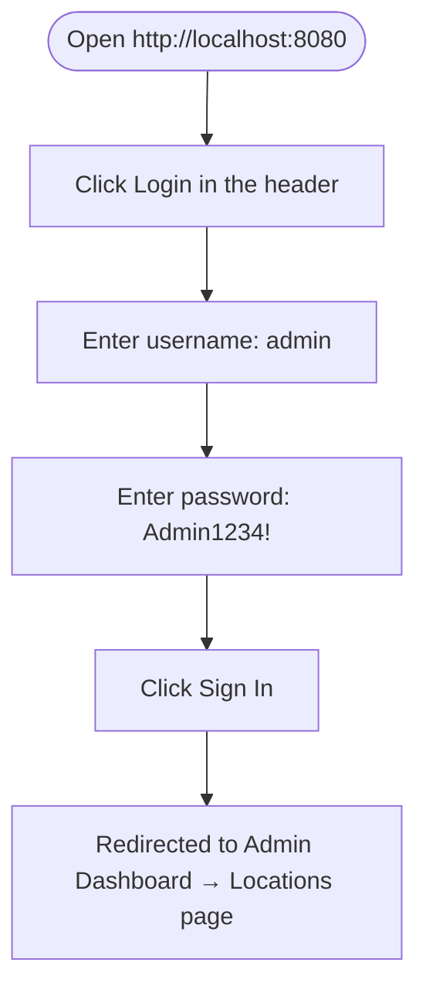
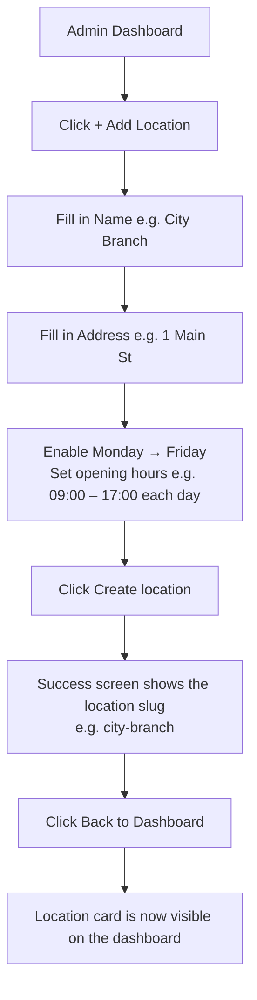
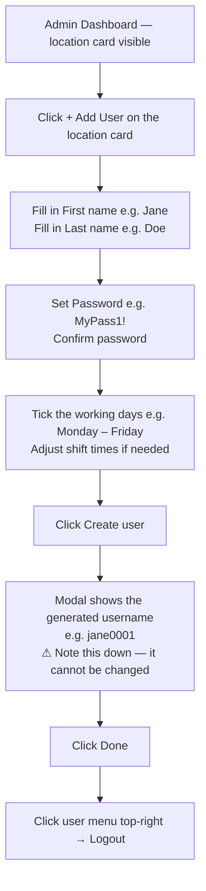
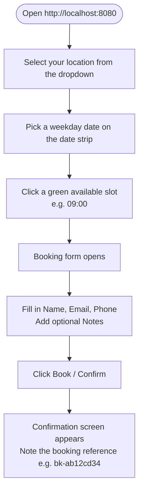
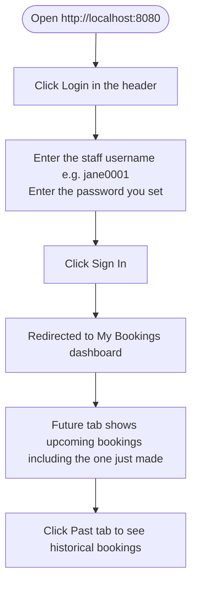
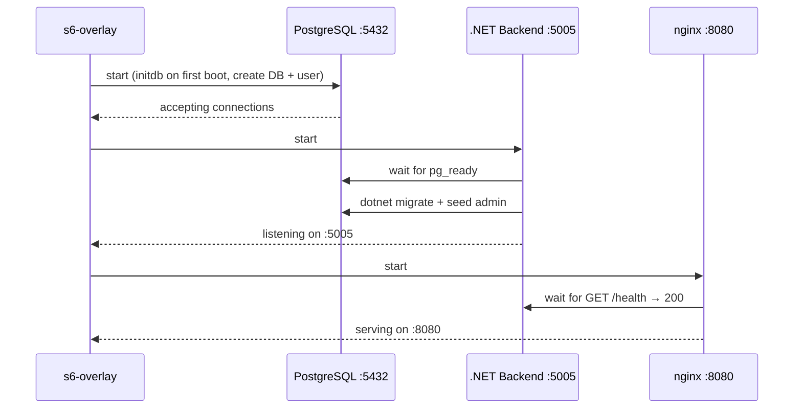
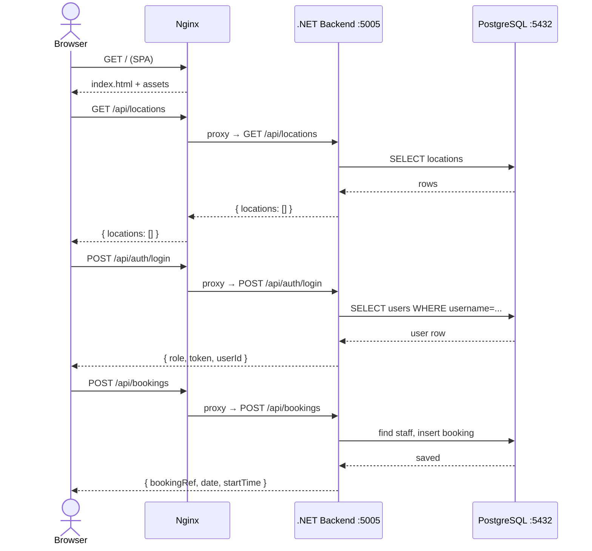

# TimeIsOnMySide

A slot-booking platform where customers book 30-minute consultation sessions with advisors at branch locations. Staff can view their assigned bookings. Admins manage locations and staff.

---

## Quick Start

> **Requires:** Docker Desktop (or Docker Engine + Compose plugin). No other tools needed.

```bash
./start-all
```

That's it. The script will:
1. Load the pre-built image (or build from source if not present)
2. Start the app + mail catcher containers
3. Wait for the app to be healthy
4. Open three browser tabs automatically

| Tab opened | URL | Description |
|-----------|-----|-------------|
| Booking page | http://localhost:8080 | Customer booking view |
| Admin login | http://localhost:8080/login | Admin / staff login |
| Mail UI | http://localhost:8025 | Mailpit — all outbound emails |

### Stop / reset

```bash
docker compose down        # stop (data preserved)
docker compose down -v     # stop and wipe all data
```

---

## Sharing this demo

To share the demo with someone who has no developer tools:

**Developer (you) — run once:**
```bash
./build-image              # builds image and saves timeisonymyside.tar.gz
zip -r demo.zip . -x '*.git*' -x 'node_modules/*'
# share demo.zip
```

**Recipient:**
```bash
unzip demo.zip
./start-all                # loads the image, starts everything, opens browser
```

The recipient needs only Docker Desktop — no Node.js, .NET SDK, or internet access required.

---

## Developer workflow

```bash
# Build image from source (requires internet)
docker compose build

# Start with live logs
docker compose up

# Start detached
docker compose up -d
```

---

## Credentials

| Role | Username | Password | Notes |
|------|----------|----------|-------|
| Admin | `admin` | `Admin1234!` | Pre-seeded on first boot |
| Staff | *(shown after creation)* | *(set when creating)* | e.g. `jane0001` |
| Client | — | — | No login required to book |

---

## End-to-End Walkthrough

Follow these flows in order to exercise every role and feature.

### Step 1 — Admin: Login



### Step 2 — Admin: Create a location



> **Note:** Slots only appear if the location has opening hours set **and** at least one staff member whose shift covers the time.

### Step 3 — Admin: Add a staff member



### Step 4 — Client: Book a slot



> **Note:** Past slots (before the current time on today's date) are shown as disabled.

### Step 5 — Staff: View bookings



---

## Architecture

### Container layout

`docker compose up` starts two containers:

```
┌─────────────────────────────────────────────────────────────────────┐
│  Docker Compose                                                     │
│                                                                     │
│  ┌──────────────────────────────────────────────────────────────┐  │
│  │  app container (port 8080)                                   │  │
│  │                                                              │  │
│  │  ┌──────────┐   proxy /api   ┌──────────────────────────┐   │  │
│  │  │  nginx   │ ─────────────▶ │  .NET 8 Backend          │   │  │
│  │  │  :8080   │                │  ASP.NET Core :5005       │   │  │
│  │  │  SPA +   │                │  EF Core 8 + MailKit      │   │  │
│  │  │  proxy   │                └──────┬────────────────────┘   │  │
│  │  └──────────┘                       │ DB          │ SMTP      │  │
│  │                                     ▼             ▼           │  │
│  │                        ┌──────────────────┐       │           │  │
│  │                        │  PostgreSQL 16   │       │           │  │
│  │                        │  :5432           │       │           │  │
│  │                        └──────────────────┘       │           │  │
│  └───────────────────────────────────────────────────┼───────────┘  │
│                                                       │              │
│  ┌────────────────────────────────────────────────────▼──────────┐  │
│  │  mailpit container                                             │  │
│  │  SMTP :1025 (internal)   Web UI :8025 ──────▶ host browser    │  │
│  └────────────────────────────────────────────────────────────────┘  │
└─────────────────────────────────────────────────────────────────────┘
```

### Startup sequence

s6-overlay enforces the dependency chain — each service waits for the previous one before starting:



### Full request flow



---

## Tech Stack

| Layer | Technology |
|-------|-----------|
| Frontend | Vue 3 · Vite · Pinia · Vue Router · Zod · TypeScript |
| Backend | ASP.NET Core 8 · EF Core 8 · FluentValidation |
| Database | PostgreSQL 16 |
| Auth | Stateless HMAC daily token (`X-Admin-Token` / `X-Staff-Token`) |
| Container | s6-overlay · nginx · .NET 8 runtime |

---

## API Reference

| Method | Path | Auth | Description |
|--------|------|------|-------------|
| `POST` | `/api/auth/login` | — | Login; returns role + token |
| `GET` | `/api/locations` | — | List all locations |
| `POST` | `/api/locations` | Admin | Create a location |
| `GET` | `/api/locations/{id}` | Admin | Get a single location |
| `GET` | `/api/locations/{id}/users` | Admin | List staff for a location |
| `POST` | `/api/users` | Admin | Create a staff user |
| `GET` | `/api/slots?date&locationId` | — | Get 30-min slots for a date + location |
| `POST` | `/api/bookings` | Rate-limited | Create a booking |
| `GET` | `/api/bookings` | Staff | Get bookings for the logged-in staff member |
| `GET` | `/health` | — | Liveness probe |

### Slot availability rules

A slot is **available** when:
- The location has opening hours for that day
- The slot time falls within those opening hours
- At least one staff member's shift covers the slot
- Not all covering staff are already booked for that slot
- The slot's start time has not yet passed (today only — past slots are `unavailable`)

---

## Local Development

### Prerequisites

| Tool | Version |
|------|---------|
| Node.js | ≥ 20.19 or ≥ 22.12 |
| .NET SDK | 8.0 |
| PostgreSQL | 14+ |

### Backend

```bash
# 1. Create the database
psql -U postgres -c "CREATE USER db_app_user WITH PASSWORD 'your-password';"
psql -U postgres -c "CREATE DATABASE overtime OWNER db_app_user;"

# 2. Add connection string + email config (gitignored)
cat > backend/overtime/appsettings.local.json <<'EOF'
{
  "ConnectionStrings": {
    "Default": "Host=localhost;Port=5432;Database=overtime;Username=db_app_user;Password=your-password"
  },
  "Email": {
    "SmtpHost": "localhost",
    "SmtpPort": 1025,
    "FromAddress": "noreply@timeisonymyside.local",
    "FromName": "TimeIsOnMySide",
    "DemoRecipientEmail": "dev@example.com"
  }
}
EOF

# Optional: run Mailpit locally to catch outbound emails (http://localhost:8025)
docker run -d -p 1025:1025 -p 8025:8025 axllent/mailpit

# 3. Migrate + seed admin
dotnet run --project backend/overtime -- -m

# 4. Start API (http://localhost:5005, Swagger at /swagger)
dotnet run --project backend/overtime --launch-profile run
```

### Frontend

```bash
cd frontend
npm install
npm run dev   # http://localhost:5173
```

### Tests

```bash
# Backend (unit + integration)
dotnet test backend/

# Frontend unit tests
cd frontend && npm run test:unit

# Frontend E2E against local dev server
cd frontend && npm run test:e2e

# Frontend E2E against a running Docker container
docker run -p 8080:8080 --name tims timeisonymyside
cd frontend && DOCKER_BASE_URL=http://localhost:8080 npx playwright test --project=docker
```
